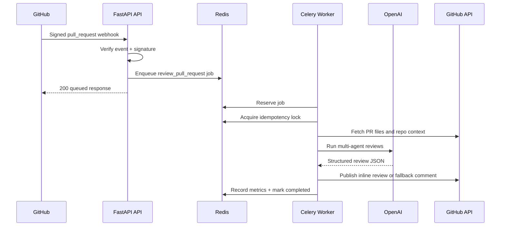

# Async Worker Flow

```mermaid
sequenceDiagram
    participant GitHub
    participant API as FastAPI API
    participant Redis
    participant Worker as Celery Worker
    participant OpenAI
    participant GitHubAPI as GitHub API

    GitHub->>API: Signed pull_request webhook
    API->>API: Verify event + signature
    API->>Redis: Enqueue review_pull_request job
    API-->>GitHub: 200 queued response
    Worker->>Redis: Reserve job
    Worker->>Redis: Acquire idempotency lock
    Worker->>GitHubAPI: Fetch PR files and repo context
    Worker->>OpenAI: Run multi-agent reviews
    OpenAI-->>Worker: Structured review JSON
    Worker->>GitHubAPI: Publish inline review or fallback comment
    Worker->>Redis: Record metrics + mark completed
```
