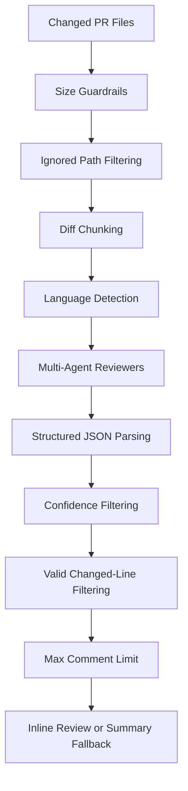

# Review Pipeline

```mermaid
flowchart TD
    files["Changed PR Files"] --> guardrails["Size Guardrails"]
    guardrails --> ignored["Ignored Path Filtering"]
    ignored --> chunks["Diff Chunking"]
    chunks --> language["Language Detection"]
    language --> reviewers["Multi-Agent Reviewers"]
    reviewers --> parsing["Structured JSON Parsing"]
    parsing --> confidence["Confidence Filtering"]
    confidence --> lines["Valid Changed-Line Filtering"]
    lines --> limit["Max Comment Limit"]
    limit --> publish["Inline Review or Summary Fallback"]
```
