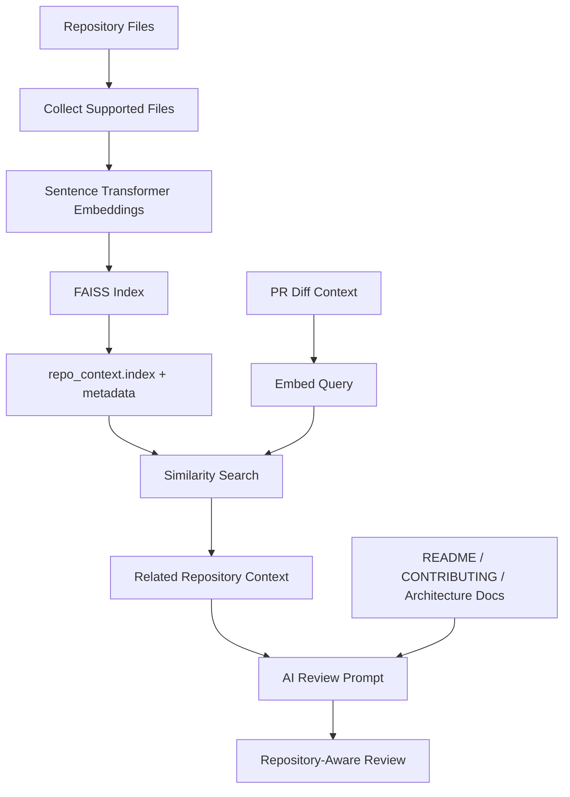

# Semantic Retrieval Flow

```mermaid
flowchart TD
    repo["Repository Files"] --> collect["Collect Supported Files"]
    collect --> embed["Sentence Transformer Embeddings"]
    embed --> index["FAISS Index"]
    index --> artifacts["repo_context.index + metadata"]

    diff["PR Diff Context"] --> query["Embed Query"]
    artifacts --> search["Similarity Search"]
    query --> search
    search --> related["Related Repository Context"]
    related --> prompt["AI Review Prompt"]
    docs["README / CONTRIBUTING / Architecture Docs"] --> prompt
    prompt --> review["Repository-Aware Review"]
```
