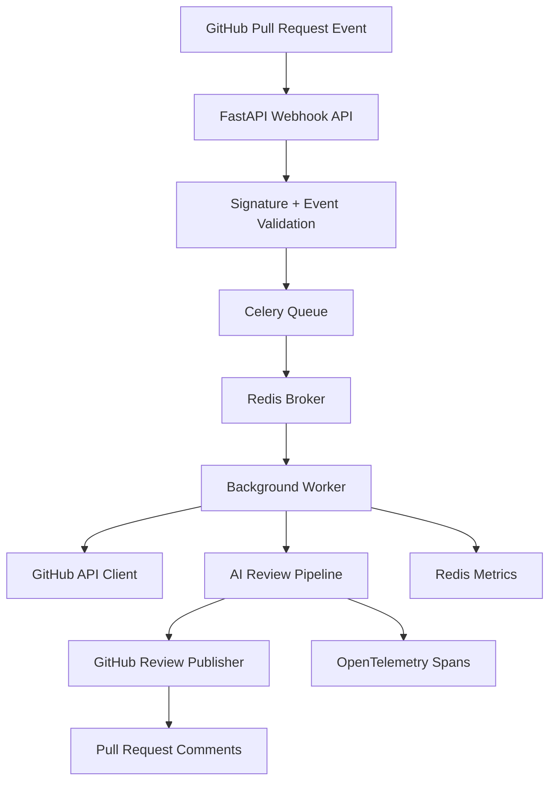

# System Architecture

```mermaid
flowchart TD
    github["GitHub Pull Request Event"] --> webhook["FastAPI Webhook API"]
    webhook --> signature["Signature + Event Validation"]
    signature --> queue["Celery Queue"]
    queue --> redis["Redis Broker"]
    redis --> worker["Background Worker"]
    worker --> github_api["GitHub API Client"]
    worker --> review["AI Review Pipeline"]
    review --> publisher["GitHub Review Publisher"]
    publisher --> pr["Pull Request Comments"]
    worker --> metrics["Redis Metrics"]
    review --> telemetry["OpenTelemetry Spans"]
```
